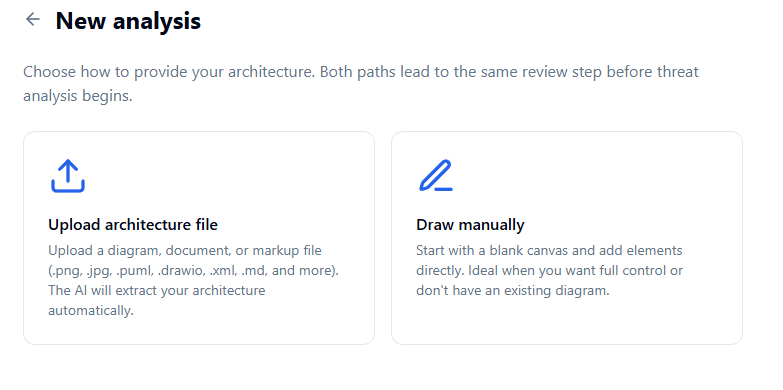
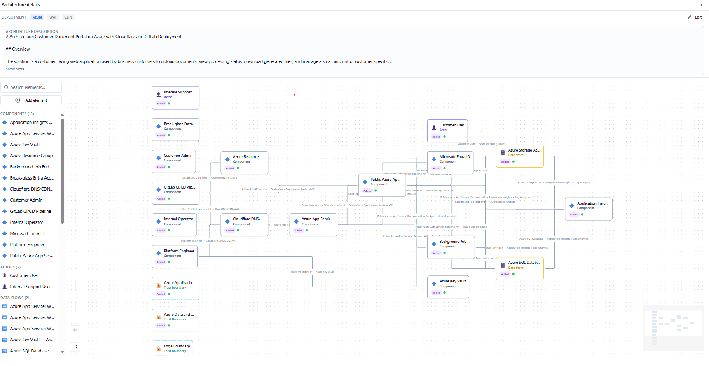
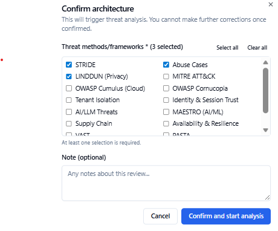
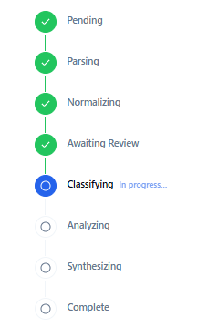
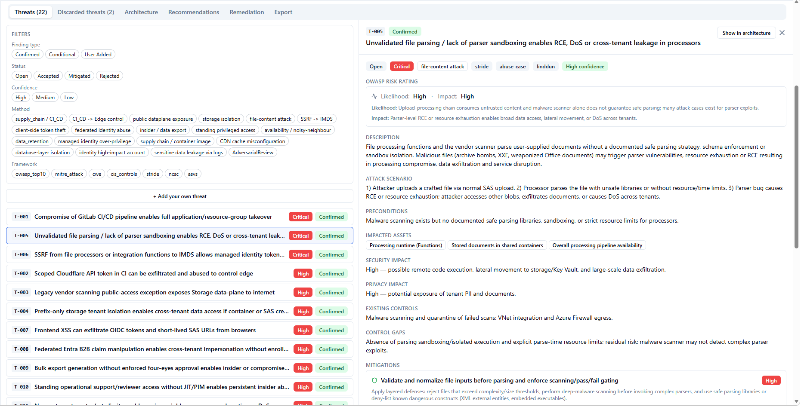
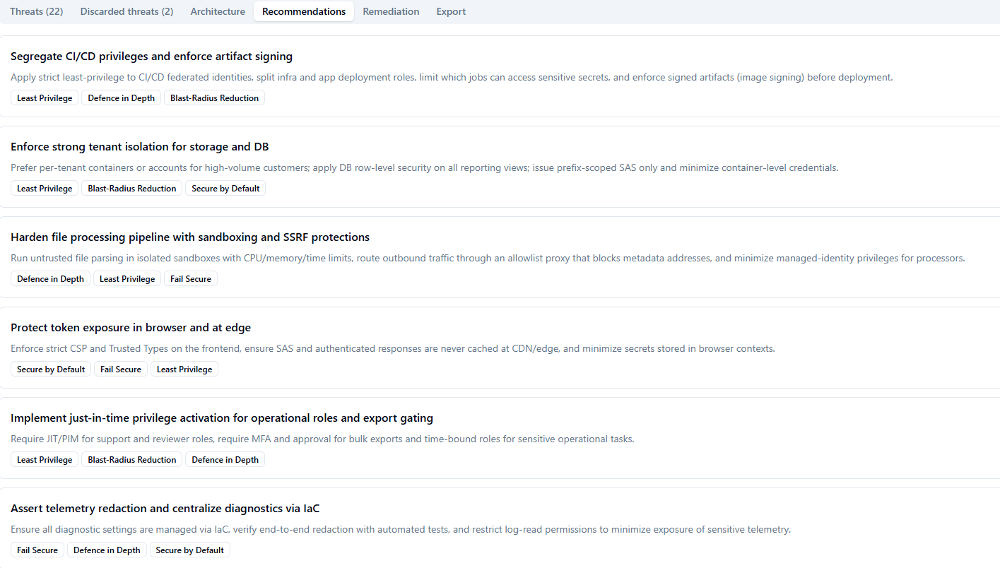
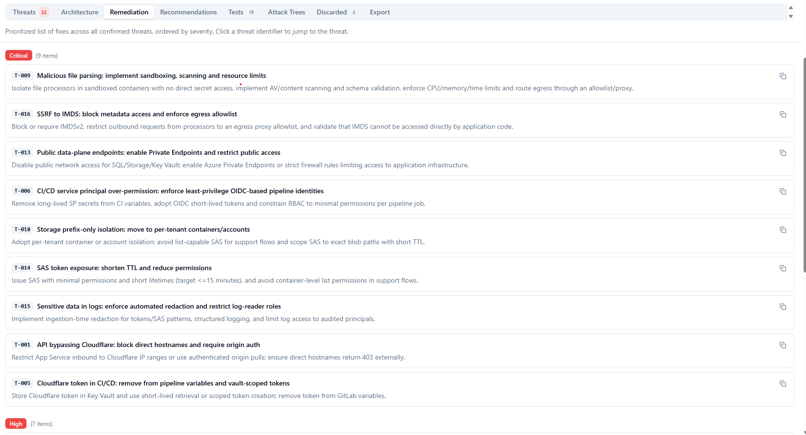

# Threat Modeling Agent

Most threat models are written by hand, guided by memory and generic checklists, long after the architecture was designed. The result is a document that reflects what engineers thought the system looked like — not what it actually is.

**The Threat Modeling Agent works the other way around.** You give it your architecture — a diagram, a markup file, or a plain-text description — and it reads the system, builds a structured model of it, lets you correct anything it misunderstood, then runs a multi-method security analysis grounded in your actual components, data flows, and trust boundaries. The output is a prioritised list of evidence-based threats, each with a concrete attack scenario, severity rating, mitigations, and framework references, plus a remediation list ready to drop into your backlog.

No templates. No blank forms. No threats that don't apply to your system.

---

## What It Does

The agent runs a multi-stage AI pipeline:

1. **Upload your architecture** — accepts images (PNG, JPG), PlantUML, Mermaid, draw.io XML, Markdown, and plain-text descriptions. The AI parses the input and extracts components, data flows, trust boundaries, actors, and data stores into a structured model automatically.
2. **Or draw it from scratch** — if you don't have an existing diagram, the built-in canvas lets you add elements manually and connect them with data flows. No diagram required to get started.
3. **You review and correct the model** — before any threats are generated, you see exactly what the AI understood. Fix misclassified elements, add missing context, confirm trust boundaries. This step is what keeps the analysis honest.
4. **Classifies the architecture** — identifies patterns that determine which methods to run: multi-tenant SaaS, cloud-native, event-driven, identity-complex, privacy-heavy, LLM-enabled, and more.
5. **Runs parallel threat analysis** — multiple analysis passes execute concurrently, each focused on a different attack lens (STRIDE, LINDDUN, abuse cases, tenant isolation, supply chain, AI/LLM threats…). Methods are pre-selected based on what your architecture actually is.
6. **Synthesises and challenges its own findings** — passes are merged, deduplicated, and put through an adversarial review that actively looks for missed threats and blind spots.
7. **Maps to control frameworks** — every finding is mapped to OWASP Top 10, ASVS, CIS Controls, NCSC, and STRIDE categories.
8. **Produces immediately actionable output** — threats with severity ratings, attack scenarios, mitigations, and acceptance criteria; secure design recommendations; a prioritised remediation list written to be pasted into a sprint backlog.

### What you get out

- **Confirmed threats** — directly evidenced by your architecture, with attack scenarios, preconditions, and affected components
- **Conditional threats** — plausible threats that depend on unverified assumptions (clearly labelled separately)
- **Evidence basis** — every finding quotes the specific architecture fact that supports it; nothing is invented
- **Control gaps** — existing controls are identified and gaps explained per finding
- **Secure design recommendations** — architectural patterns to adopt, tagged with security principles (Least Privilege, Defence in Depth, Blast-Radius Reduction…)
- **Prioritised remediation list** — threats ranked by likelihood × impact, written as backlog-ready action items
- **Framework mappings** — OWASP, ASVS, NCSC references on every confirmed finding

### Architecture types supported

Web apps · REST APIs · SPAs · BFFs · Microservices · Event-driven systems · Multi-tenant SaaS · Cloud-native (Azure / AWS / GCP) · Identity-complex systems · LLM-enabled apps · Agentic / MCP-enabled systems

---

## Screenshots

### Starting a new analysis



Two paths into the tool: upload an existing architecture file (diagram, markup, document — the AI extracts the structure automatically) or start with a blank canvas and draw elements manually. Both paths lead to the same review step before any analysis runs.

---

### Architecture review — see what the AI understood, correct it before analysis



After the pipeline parses your input it displays the extracted architecture as an interactive graph. Actors, components, data stores, data flows, and trust boundaries are laid out visually with severity overlays showing threat density per node. This is the key step: you inspect the model, correct misclassified elements, fill in gaps, and confirm trust boundaries before committing to analysis. The threat model is only as good as the architecture it is based on — this review step ensures the AI is working from reality, not its best guess.

---

### Framework selection — choose your analysis methods



When you confirm the architecture, you choose which threat modeling methods to run. The system pre-selects methods that match your detected architecture type — LINDDUN for privacy-heavy systems, Tenant Isolation for multi-tenant SaaS, AI/LLM Threats for LLM-enabled systems, and so on. You can add or remove any combination before triggering analysis.

---

### Pipeline progress — live stage tracking



A live progress view shows which pipeline stage is running. Completed stages are marked with a green tick. Stages run in sequence — Parsing → Normalizing → Awaiting Review → Classifying → Analyzing → Synthesizing — with the Analyzing stage running all selected method passes in parallel before synthesis merges the results.

---

### Threats — detailed, evidence-based findings



The Threats tab shows every confirmed and conditional finding. Each threat includes a severity rating, the affected components, a step-by-step attack scenario, the architecture evidence that supports it, preconditions, mitigations with acceptance criteria, and OWASP/ASVS/NCSC framework references. Conditional threats are clearly separated from confirmed ones. Filter by severity, method, framework, or click any component in the architecture tab to see only its threats.

---

### Recommendations — actionable secure design patterns



The Recommendations tab surfaces architectural patterns that address clusters of related threats. Each recommendation is written as a concrete design change — not a generic checklist item — and tagged with the security principles it applies (Least Privilege, Defence in Depth, Blast-Radius Reduction, Secure by Default, Fail Secure). Recommendations are generated at synthesis time and grouped thematically so teams can plan work around coherent design improvements rather than individual bug fixes.

---

### Remediation — prioritised backlog, ready to use



The Remediation tab presents every confirmed threat ranked by severity (Critical → High → Medium → Low). Each entry shows the threat ID, a short action title, and a one-sentence description of what to implement — written to be pasted directly into a backlog ticket. Work through Critical items first. Every entry links back to the full threat detail so whoever implements the fix has all the context they need.

---

## Export Formats

Every completed threat model can be exported from the **Export** tab in five formats:

| Format | File | Use case |
|---|---|---|
| **JSON** | `threat-model-<id>.json` | Full structured analysis blob — all threats, mitigations, evidence, framework mappings, and metadata. Machine-readable, suitable for downstream tooling or archiving. |
| **Markdown report** | `threat-model-<id>.md` | Human-readable threat model report with all findings, attack scenarios, mitigations, recommendations, and remediation list. Ready to commit to a repo or paste into a wiki. |
| **Mermaid diagram** | `architecture-<id>.mmd` | The extracted and corrected architecture re-exported as a Mermaid flowchart. Editable, diff-able, and renderable in GitHub, GitLab, and most documentation tools. |
| **TM-BOM** | `tm-bom-<id>.json` | Portable threat-model Bill of Materials — architecture, methods used, all threats, and control mappings in a structured interchange format. Designed for tool-to-tool transfer. |
| **Threat Dragon v2** | `threat-dragon-v2-<id>.json` | Architecture and threats projected into OWASP Threat Dragon v2 JSON format, for teams already using Threat Dragon in their workflow. |

---

## Quick Start

**Prerequisites:** .NET 10 SDK, Node.js 20+, Docker Desktop, `dotnet-ef` global tool.

```bash
# 1. Start local services (PostgreSQL, Azurite, Service Bus emulator)
docker compose up -d

# 2. Apply database migrations
dotnet ef database update \
  --project src/ThreatModelingAgent.Infrastructure \
  --startup-project src/ThreatModelingAgent.Api

# 3. Configure local settings
#    Copy and edit the example files — see docs/deployment/local.md for all options
cp src/ThreatModelingAgent.Api/appsettings.Development.json.example \
   src/ThreatModelingAgent.Api/appsettings.Development.json
cp src/ThreatModelingAgent.Worker/appsettings.Development.json.example \
   src/ThreatModelingAgent.Worker/appsettings.Development.json

# 4. Run
dotnet run --project src/ThreatModelingAgent.Api     # terminal 1 → http://localhost:5240
dotnet run --project src/ThreatModelingAgent.Worker  # terminal 2
cd frontend && npm install && npm run dev             # terminal 3 → http://localhost:5173
```

See **[docs/deployment/local.md](docs/deployment/local.md)** for the full local setup guide including auth options.

---

## LLM Providers

The agent supports four providers. Mix and match — route heavy security reasoning to a strong model and classification tasks to a cheap one.

| Provider | Key(s) required | Recommended `StrongModel` | Recommended `LowCostModel` |
|---|---|---|---|
| **OpenAI** | `OpenAI:ApiKey` | `gpt-5.1` | `gpt-5-mini` |
| **Azure OpenAI** | `AzureOpenAI:Endpoint` + `AzureOpenAI:ApiKey` | `gpt-5.1` | `gpt-5-mini` |
| **Anthropic** | `Anthropic:ApiKey` | `claude-opus-4-7` | `claude-haiku-4-5-20251001` |
| **Google Gemini** | `Google:ApiKey` ([aistudio.google.com](https://aistudio.google.com)) | `gemini-2.5-pro` | `gemini-2.5-flash` |

Set `LlmRouting:StrongModel` and `LlmRouting:LowCostModel` in `src/ThreatModelingAgent.Worker/appsettings.Development.json`.

When both `OpenAI:ApiKey` and `AzureOpenAI` credentials are present, plain OpenAI takes priority for `gpt-*` / `o-series` model names.

> **Tip — token limits:** All `MaxOutputTokens` config values default to `0`, which tells the agent to use the model's own ceiling. Only set explicit values if you need to cap costs or stay within a TPM limit.

---

## Authentication

### Option A — Dev auth (local only, no account needed)

Enable in both configs to skip WorkOS entirely:

```json
// Api appsettings.Development.json
"DevAuth": { "Enabled": true, "SigningKey": "dev-local-signing-key-change-me-32chars!!" }
```

```
# frontend/.env.local
VITE_DEV_AUTH=true
```

Then sign in at `http://localhost:5173/login` with any email address. See [docs/deployment/local.md](docs/deployment/local.md) for details.

### Option B — WorkOS (recommended for staging/production)

This app uses [WorkOS](https://workos.com) for authentication — the free tier is sufficient for local development.

1. Sign up at [workos.com](https://workos.com) → create an application → enable **User Management (AuthKit)**
2. Copy credentials from **API Keys** in the dashboard:

| Config key | Where to find it |
|---|---|
| `WorkOS:ClientId` | Client ID (starts with `client_`) |
| `WorkOS:ApiKey` | Secret Key (starts with `sk_`) |

3. Add redirect URIs under **Redirects** in the dashboard:

| Type | Local dev | Production |
|---|---|---|
| Sign-in redirect URI | `http://localhost:5173/auth/callback` | `https://yourdomain.com/auth/callback` |
| Sign-out redirect URI | `http://localhost:5173/login` | `https://yourdomain.com/login` |

4. Set values in `appsettings.Development.json`:

```json
"WorkOS": {
  "ClientId": "client_XXXXXXXXXXXX",
  "ApiKey":   "sk_XXXXXXXXXXXX",
  "Issuer":   "https://api.workos.com",
  "JwksUri":  "https://api.workos.com/.well-known/jwks.json"
}
```

Per-org SSO (SAML/OIDC) is supported via WorkOS Organizations. Configure connections in the WorkOS dashboard — the app receives a standard JWT regardless of IDP.

---

## How the Pipeline Works

```
Upload diagram or text description
         │
         ▼
  DETECT  ─ identify artifact type (image / PlantUML / Mermaid / draw.io / text)
         │
         ▼
  PARSE   ─ extract raw elements, flows, boundaries, and relationships
         │
         ▼
  NORMALIZE ─ build a structured canonical architecture model
         │
         ▼
  ┌── USER REVIEW ──────────────────────────────────────────────────┐
  │  Inspect the extracted architecture. Correct mistakes,          │
  │  add missing context, confirm trust boundaries.                 │
  └─────────────────────────────────────────────────────────────────┘
         │
         ▼
  CLASSIFY ─ categorise the architecture, select threat modeling methods
         │
         ▼
  ANALYZE  ─ run parallel analysis passes (STRIDE, LINDDUN, abuse cases,
         │   tenant isolation, AI threats, …) — one pass per method
         │
         ▼
  SYNTHESIZE ─ merge, deduplicate, adversarial review, map to frameworks,
               produce final output with mitigations and remediation list
```

Every finding is traceable back to a specific architecture element and cites the evidence that supports it. If the evidence is weak or depends on an unverified assumption, the finding is marked conditional rather than confirmed.

---

## Project Structure

```
TMSupportAgent/
├── CLAUDE.md                    # Security specification (mandatory — read before writing code)
├── docker-compose.yml           # Local dev services (PostgreSQL, Azurite, Service Bus)
│
├── docs/
│   ├── specs/                   # Feature and architecture specs (source of truth)
│   ├── adr/                     # Architecture Decision Records
│   ├── api/openapi.yaml         # OpenAPI 3.1 contract
│   └── deployment/              # local.md · azure.md
│
├── infra/                       # Bicep modules for Azure deployment
├── .github/workflows/           # CI (every PR) + CD (merge to main)
│
└── src/
    ├── ThreatModelingAgent.Api/         # ASP.NET Core REST API
    ├── ThreatModelingAgent.Worker/      # Background pipeline worker
    ├── ThreatModelingAgent.Domain/      # Domain entities and interfaces
    └── ThreatModelingAgent.Infrastructure/  # EF Core, repositories, Azure clients
```

---

## Deployment

| Target | Guide |
|---|---|
| Local development | [docs/deployment/local.md](docs/deployment/local.md) |
| Azure (production/staging) | [docs/deployment/azure.md](docs/deployment/azure.md) |

CI runs on every pull request. Deployment is triggered manually via **Actions → Deploy** — choose `staging` or `prod`.

---

## License

TMSupportAgent is source-available under the [Business Source License 1.1](LICENSE).

Non-commercial personal use, learning, and experimentation are permitted under the license terms.

Commercial or business use requires a separate commercial license agreement.

For commercial licensing, contact: **marcus@marcuspe.se**.

---

## Contributing

1. Read [CLAUDE.md](CLAUDE.md) before writing any code — it is the mandatory security specification.
2. Check [docs/specs/README.md](docs/specs/README.md) for what is specced and approved.
3. Architectural decisions go in an ADR before implementation.
4. All PRs must reference the spec they implement.

Security requirements are functional acceptance criteria — a feature is not done if mandatory security controls are missing.

For questions, ideas, or contribution proposals, reach out at **marcus@marcuspe.se**.
