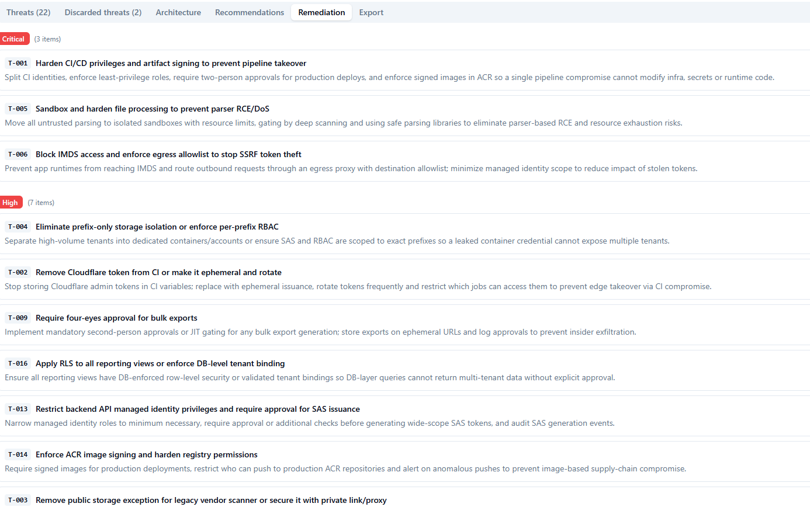

# Threat Modeling Agent

**Stop writing threat models by hand.** Upload your architecture diagram — or just describe your system in plain text — and get a structured, evidence-based threat model in minutes, not days.

Built for engineering teams who want security analysis that is actually grounded in *their* architecture, not a generic checklist copy-pasted from a wiki.

---

## What It Does

The Threat Modeling Agent takes your architecture as input and runs it through a multi-stage AI pipeline that:

1. **Understands your system** — parses diagrams (images, PlantUML, Mermaid, draw.io) or free-text descriptions into a structured canonical model covering components, data flows, trust boundaries, actors, data stores, auth model, and more
2. **Lets you correct the model** — before any threats are generated, you review and fix the extracted architecture so analysis is grounded in reality
3. **Selects the right methods** — dynamically picks STRIDE, LINDDUN, abuse-case analysis, tenant isolation analysis, AI/LLM threat analysis, and more based on what your architecture actually is
4. **Runs parallel threat analysis** — multiple analysis passes run concurrently, each focused on a different attack lens, then get merged and deduplicated
5. **Challenges its own findings** — an adversarial review pass looks for missed threats and blind spots before finalising
6. **Maps to control frameworks** — every finding is mapped to OWASP Top 10, ASVS, CIS Controls, NCSC, and STRIDE categories
7. **Produces actionable output** — threats with severity ratings, mitigations, secure design recommendations, and a prioritised remediation list ready for your backlog

### What you get out

- **Confirmed threats** — directly evidenced by your architecture with attack scenarios, preconditions, and affected components
- **Conditional threats** — plausible threats that depend on unverified assumptions (clearly flagged)
- **Control gaps** — existing controls identified and gaps explained
- **Secure design recommendations** — architectural patterns to adopt
- **Prioritised remediation list** — threats ranked by likelihood × impact so you know where to start
- **Framework mappings** — OWASP, ASVS, NCSC references on every finding

### Architecture types covered

Web apps · REST APIs · SPAs · BFFs · Microservices · Event-driven systems · Multi-tenant SaaS · Cloud-native systems · Identity-complex systems · LLM-enabled apps · Agentic / MCP-enabled systems

---

## Quick Start

**Prerequisites:** .NET 10 SDK, Node.js 20+, Docker Desktop, `dotnet-ef` global tool.

```bash
# 1. Start local services (PostgreSQL, Azurite, Service Bus emulator)
docker compose up -d

# 2. Apply database migrations
dotnet ef database update \
  --project src/ThreatModelingAgent.Infrastructure \
  --startup-project src/ThreatModelingAgent.Api

# 3. Configure local settings
#    Copy and edit the example files — see docs/deployment/local.md for all options
cp src/ThreatModelingAgent.Api/appsettings.Development.json.example \
   src/ThreatModelingAgent.Api/appsettings.Development.json
cp src/ThreatModelingAgent.Worker/appsettings.Development.json.example \
   src/ThreatModelingAgent.Worker/appsettings.Development.json

# 4. Run
dotnet run --project src/ThreatModelingAgent.Api     # terminal 1 → http://localhost:5240
dotnet run --project src/ThreatModelingAgent.Worker  # terminal 2
cd frontend && npm install && npm run dev             # terminal 3 → http://localhost:5173
```

See **[docs/deployment/local.md](docs/deployment/local.md)** for the full local setup guide including auth options.

---

## LLM Providers

The agent supports four providers. Mix and match — route heavy security reasoning to a strong model and classification tasks to a cheap one.

| Provider | Key(s) required | Recommended `StrongModel` | Recommended `LowCostModel` |
|---|---|---|---|
| **OpenAI** | `OpenAI:ApiKey` | `gpt-5.1` | `gpt-5-mini` |
| **Azure OpenAI** | `AzureOpenAI:Endpoint` + `AzureOpenAI:ApiKey` | `gpt-5.1` | `gpt-5-mini` |
| **Anthropic** | `Anthropic:ApiKey` | `claude-opus-4-7` | `claude-haiku-4-5-20251001` |
| **Google Gemini** | `Google:ApiKey` ([aistudio.google.com](https://aistudio.google.com)) | `gemini-2.5-pro` | `gemini-2.5-flash` |

Set `LlmRouting:StrongModel` and `LlmRouting:LowCostModel` in `src/ThreatModelingAgent.Worker/appsettings.Development.json`.

When both `OpenAI:ApiKey` and `AzureOpenAI` credentials are present, plain OpenAI takes priority for `gpt-*` / `o-series` model names.

> **Tip — token limits:** All `MaxOutputTokens` config values default to `0` in the development config, which tells the agent to use the model's own ceiling. Only set explicit values if you need to cap costs or stay within a TPM limit.

---

## Authentication

### Option A — Dev auth (local only, no account needed)

Enable in both configs to skip WorkOS entirely:

```json
// Api appsettings.Development.json
"DevAuth": { "Enabled": true, "SigningKey": "dev-local-signing-key-change-me-32chars!!" }
```

```
# frontend/.env.local
VITE_DEV_AUTH=true
```

Then sign in at `http://localhost:5173/login` with any email address. See [docs/deployment/local.md](docs/deployment/local.md) for details.

### Option B — WorkOS (recommended for staging/production)

This app uses [WorkOS](https://workos.com) for authentication — free tier is sufficient for local development.

1. Sign up at [workos.com](https://workos.com) → create an application → enable **User Management (AuthKit)**
2. Copy credentials from **API Keys** in the dashboard:

| Config key | Where to find it |
|---|---|
| `WorkOS:ClientId` | Client ID (starts with `client_`) |
| `WorkOS:ApiKey` | Secret Key (starts with `sk_`) |

3. Add redirect URIs under **Redirects** in the dashboard:

| Type | Local dev | Production |
|---|---|---|
| Sign-in redirect URI | `http://localhost:5173/auth/callback` | `https://yourdomain.com/auth/callback` |
| Sign-out redirect URI | `http://localhost:5173/login` | `https://yourdomain.com/login` |

4. Set values in `appsettings.Development.json`:

```json
"WorkOS": {
  "ClientId": "client_XXXXXXXXXXXX",
  "ApiKey":   "sk_XXXXXXXXXXXX",
  "Issuer":   "https://api.workos.com",
  "JwksUri":  "https://api.workos.com/.well-known/jwks.json"
}
```

Per-org SSO (SAML/OIDC) is supported via WorkOS Organizations. Configure connections in the WorkOS dashboard — the app receives a standard JWT regardless of IDP.

---

## How the Pipeline Works

```
Upload diagram or text description
         │
         ▼
  DETECT  ─ identify artifact type (image / PlantUML / Mermaid / draw.io / text)
         │
         ▼
  PARSE   ─ extract raw elements, flows, boundaries, and relationships
         │
         ▼
  NORMALIZE ─ build a structured canonical architecture model
         │
         ▼
  ┌── USER REVIEW ──────────────────────────────────────────────────┐
  │  Inspect the extracted architecture. Correct mistakes,          │
  │  add missing context, confirm trust boundaries.                 │
  └─────────────────────────────────────────────────────────────────┘
         │
         ▼
  CLASSIFY ─ categorise the architecture, select threat modeling methods
         │
         ▼
  ANALYZE  ─ run parallel analysis passes (STRIDE, LINDDUN, abuse cases,
         │   tenant isolation, AI threats, …) — one pass per method
         │
         ▼
  SYNTHESIZE ─ merge, deduplicate, map to frameworks, adversarial review,
               produce final output with mitigations and remediation list
```

Every finding is traceable back to a specific architecture element. Nothing is invented — if the evidence is weak, the finding is marked conditional.

---

## Screenshots

### Architecture review — inspect and correct the extracted model


After uploading your diagram or description, the pipeline extracts a structured architecture model and displays it as an interactive graph. Actors, components, data stores, and trust boundaries are laid out visually. Before any threats are generated, you review this extraction — correct misclassified elements, fill in missing context, and confirm that the model reflects reality. This step is what keeps the threat model grounded in your actual system rather than a generic template.

---

### Framework selection — choose your analysis methods


Once you are happy with the extracted architecture, a confirmation dialog lets you select which threat modeling methods to run. The system pre-selects methods that match your architecture type (for example, LINDDUN is pre-selected for systems with significant personal data flows). You can add or remove methods and leave an optional note before triggering the analysis. Selections include STRIDE, LINDDUN, Abuse Cases, Tenant Isolation, AI/LLM Threats, MITRE ATT&CK, PASTA, MAESTRO, and more.

---

### Pipeline progress — real-time stage tracking


A live progress indicator shows which pipeline stage is running. Completed stages are marked with a green checkmark. The current stage shows an "In progress" label. Stages run in order: Pending → Parsing → Normalizing → Awaiting Review → Classifying → Analyzing → Synthesizing → Complete. The Analyzing stage runs multiple passes in parallel (one per selected method) before synthesis merges the results.

---

### Threats — detailed findings with evidence and mitigations


The Threats tab shows every confirmed and conditional finding. Each threat card includes the threat title, severity rating, affected components, attack scenario, evidence basis (a direct quote from the architecture), preconditions, mitigations, and framework mappings (OWASP, ASVS, NCSC). Conditional threats are clearly flagged — they are plausible but depend on assumptions not confirmed in the architecture. A sidebar lets you filter by severity, method, or affected element.

---

### Recommendations — secure design patterns to adopt


The Recommendations tab surfaces architectural patterns and controls that address clusters of related threats. Each recommendation is written as an actionable design change (not a generic checklist item) and tagged with the security principles it applies — Least Privilege, Defence in Depth, Blast-Radius Reduction, Secure by Default, or Fail Secure. Recommendations are generated at the synthesis step and grouped thematically so teams can plan work around coherent design improvements.

---

### Remediation — prioritised backlog ready for your sprint



The Remediation tab presents every confirmed threat ranked by severity (Critical → High → Medium → Low). Each entry shows the threat ID, a short remediation title, and a one-sentence description of what to do — written to be pasted directly into a backlog ticket. The list is meant to be the starting point for your sprint planning: work through Critical items first, then High, and so on. Every item links back to the full threat detail so the developer implementing the fix has the complete context.

---

## Project Structure

```
TMSupportAgent/
├── CLAUDE.md                    # Security specification (mandatory — read before writing code)
├── docker-compose.yml           # Local dev services (PostgreSQL, Azurite, Service Bus)
│
├── docs/
│   ├── specs/                   # Feature and architecture specs (source of truth)
│   ├── adr/                     # Architecture Decision Records
│   ├── api/openapi.yaml         # OpenAPI 3.1 contract
│   └── deployment/              # local.md · azure.md
│
├── infra/                       # Bicep modules for Azure deployment
├── .github/workflows/           # CI (every PR) + CD (merge to main)
│
└── src/
    ├── ThreatModelingAgent.Api/         # ASP.NET Core REST API
    ├── ThreatModelingAgent.Worker/      # Background pipeline worker
    ├── ThreatModelingAgent.Domain/      # Domain entities and interfaces
    └── ThreatModelingAgent.Infrastructure/  # EF Core, repositories, Azure clients
```

---

## Deployment

| Target | Guide |
|---|---|
| Local development | [docs/deployment/local.md](docs/deployment/local.md) |
| Azure (production/staging) | [docs/deployment/azure.md](docs/deployment/azure.md) |

CI runs on every pull request. Deployment to staging runs automatically on merge to `main`.

---

## Contributing

1. Read [CLAUDE.md](CLAUDE.md) before writing any code — it is the mandatory security specification.
2. Check [docs/specs/README.md](docs/specs/README.md) for what is specced and approved.
3. Architectural decisions go in an ADR before implementation.
4. All PRs must reference the spec they implement.

Security requirements are functional acceptance criteria — a feature is not done if mandatory security controls are missing.
